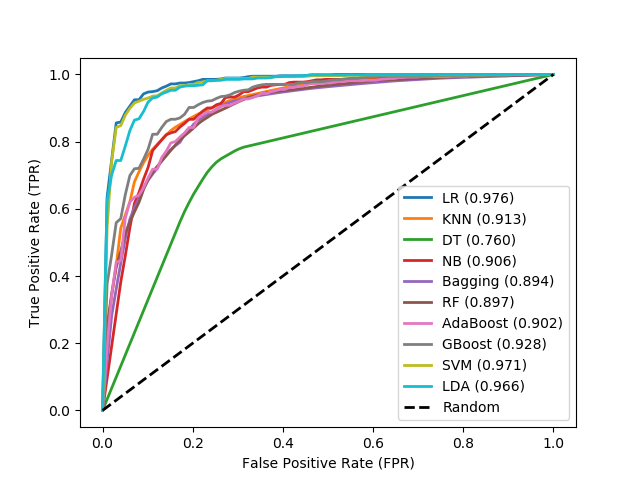
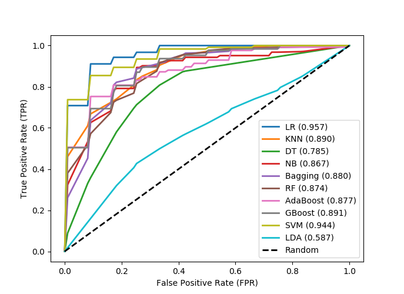
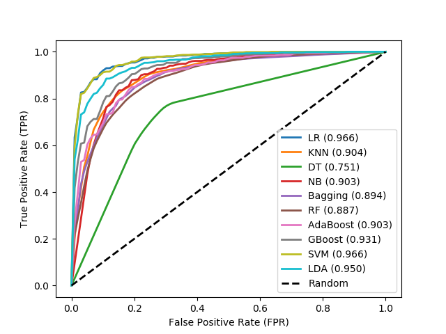
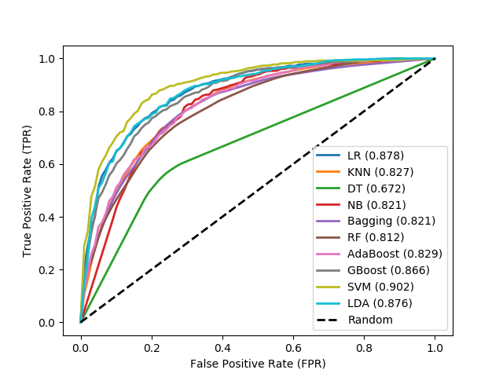

# 1. Performance Measures on DNA Dataset

### 1.1. DNA, trained on sigma70 dataset

&nbsp;

Table 1: Different classifiers achieved during cross-fold validation on sigma70 training dataset.

| Classifier | Accuracy (%) |  auROC | auPR   | Sn (%) |  Sp (%)  | F1-Score |  MCC   |
| :---       | :---:        | :---:  |  :---: | :---:  | :---:    | :---:    | ---:  |
|LR |92.88|0.9755|0.9789|93.79|91.90|0.9293|0.8583|
|SVM|91.50|0.9711|0.9738|92.31|90.69|0.9159|0.8306|
|KNN|84.63|0.9129|0.8858|83.40|85.96|0.8451|0.6954|
|Decision Tree|76.04|0.7604|0.6990|75.98|76.11|0.7601|0.5220|
|Naive Bayes|84.40|0.9061|0.8703|85.83|83.00|0.8420|0.6896|
|Bagging|82.11|0.8936|0.8641|80.16|84.08|0.8174|0.6439|
|Random Forest|82.16|0.8972|0.8741|78.95|85.43|0.8156|0.6466|
|AdaBoost|82.72|0.9023|0.8939|82.05|83.40|0.8264|0.6553|
|Gradient Boosting|85.15|0.9281|0.9293|86.64|83.67|0.8544|0.7050|
|LDA|90.28|0.9659|0.9702|91.63|88.93|0.9042|0.8067|

Note: The number of promoter (+ve) sequences and the number of non-promoter (-ve) sequences are 741 and 1400 respectively.

&nbsp;

Figure 1: Receiver Operation Characteristic (ROC) curve for different classifiers achieved during cross-fold
validation on sigma70 training dataset.

We can [download](http://lin-group.cn/server/iPro70PseZNC/data.html) sigma70 dataset from the given link.

&nbsp;

# 2. Performance Measures on RNA Dataset

### 2.1. RNA, trained on PAI244 dataset

&nbsp;

Table 2: Different classifiers achieved during cross-fold validation on PAI244 training dataset.

| Classifier | Accuracy (%) |  auROC | auPR   | Sn (%) |  Sp (%)  | F1-Score |  MCC   |
| :---       | :---:        | :---:  |  :---: | :---:  | :---:    | :---:    | ---:  |
|LR|88.50|0.9569|0.9607|88.80|88.24|0.8886|0.7770|
|KNN|81.15|0.8903|0.8759|78.99|83.20|0.8134|0.6293|
|Decision Tree|78.67|0.7854|0.7348|73.11|84.00|0.7967|0.5938|
|Naive Bayes|77.89|0.8672|0.8536|89.92|66.40|0.7426|0.5861|
|Bagging|81.15|0.8802|0.8605|77.31|84.80|0.8233|0.6294|
|Random Forest|79.10|0.8736|0.8649|78.15|80.00|0.7959|0.5876|
|AdaBoost|79.51|0.8773|0.8947|76.47|82.40|0.8108|0.5961|
|Gradient Boosting|81.97|0.8907|0.8968|77.31|86.40|0.8289|0.6493|
|SVM|83.20|0.9439|0.9549|78.15|88.00|0.8433|0.6703|
|LDA|59.02|0.5865|0.5849|56.30|61.60|0.6063|0.1896|

Note: The number of RNA (+ve) sequences and the number of RNA (-ve) sequences are 125 and 119 respectively for the PAI244 dataset.

&nbsp;

Figure 2: Receiver Operation Characteristic (ROC) curve for different classifiers achieved during cross-fold
validation on PAI244 training dataset.

&nbsp;

### 2.2. RNA, tested on PAI300 (There are 300 positive instances, but there are no negative instances) dataset

&nbsp;

Table 3: Different classifiers achieved during cross-fold validation on PAI300 (300 positive instances) testing dataset.

| Classifier |  Sn (%) |
| :---       | ---:  |
|LR|84.67|
|KNN|72.33|
|Decision Tree|65.67|
|Naive Bayes|80.33|
|Bagging|69.33|
|Random Forest|71.67|
|AdaBoost|72.00|
|Gradient Boosting|71.33|
|SVM|81.33|
|LDA|51.67|

`LR is able to classify 254 instance of 300.`

We can [download](http://lin-group.cn/server/AtoI/data) RNA dataset from the given link.

&nbsp;

# 3. Performance Measures on Protein Datasets

### 3.1. DNA-binding Protein, trained on PDB1075 dataset

&nbsp;

Table 4: Different classifiers achieved during cross-fold validation on PDB1075 training dataset.

| Classifier | Accuracy (%) |  auROC | auPR   | Sn (%) |  Sp (%)  | F1-Score |  MCC   |
| :---       | :---:        | :---:  |  :---: | :---:  | :---:    | :---:    | ---:  |
|LR| 90.88 |0.9662|0.9717|91.36|90.42|0.9089|0.8186|
|SVM|89.67|0.9665|0.9714|90.69|88.80|0.8983|0.7967|
|KNN| 84.19 |0.9042|0.8778|84.48|83.94|0.8425|0.6851|
|Decision Tree|75.07|0.7509|0.6883|76.11|74.09|0.7527|0.5039|
|Naive Bayes|83.72|0.9031|0.8691|83.13|84.35|0.8362|0.6756|
|Bagging|82.70|0.8941|0.8755|80.70|84.75|0.8233|0.6569|
|Random Forest|80.65|0.8871|0.8619|76.92|84.35|0.7988|0.6160|
|AdaBoost|82.88|0.9031|0.9006|83.13|82.59|0.8291|0.6578|
|Gradient Boosting|85.30|0.9309|0.9338|86.77|83.94|0.8555|0.7096|
|LDA|87.63|0.9503|0.9563|88.26|87.04|0.8774|0.7541|

Note: The number of DNA-binding protein (+ve) sequences and the number of non-DNA-binding protein (-ve) sequences
are 525 and 550 respectively for the PDB1075 dataset.

&nbsp;

Figure 3: Receiver Operation Characteristic (ROC) curve for different classifiers achieved during cross-fold
validation on PDB1075 training dataset.

&nbsp;

### 3.2. DNA-binding Protein, tested on PDB186 dataset

&nbsp;

Table 5: Different classifiers achieved on independent PDB186 testing dataset.

| Classifier | Accuracy (%) |  auROC | auPR   | Sn (%) |  Sp (%)  | F1-Score |  MCC   |
| :---       | :---:        | :---:  |  :---: | :---:  | :---:    | :---:    | :---:  |
|LR|83.33|0.8780|0.8357|71.93|89.36|0.7480|0.6259|
|SVM| 81.18 |0.9021|0.7921|70.58|86.57|0.7205|0.5783|
|KNN| 77.42 |0.8270|0.6715|68.29|81.79|0.6734|0.4990|
|Decision Tree |70.43|0.6722|0.4768|56.95|77.50|0.5706|0.3457|
|Naive Bayes |74.73|0.8208|0.6438|73.95|76.29|0.6769|0.4874|
|Bagging|76.34|0.8206|0.6837|53.04|88.21|0.6052|0.4480|
|Random Forest|75.27|0.8120|0.6699|49.80|88.36|0.5788|0.4211|
|AdaBoost|76.34|0.8294|0.7134|63.43|83.14|0.6496|0.4742|
|Gradient Boosting|78.49|0.8661|0.7706|67.21|86.71|0.6987|0.5519|
|LDA|79.57|0.8762|0.7817|71.93|86.93|0.7312|0.5937|

Note: The number of DNA-binding protein (+ve) sequences and the number of non-DNA-binding protein (-ve) sequences are 93 and  93 respectively for the PDB186 dataset.

&nbsp;

Figure 4: Receiver Operation Characteristic (ROC) curve for different classifiers achieved during cross-fold
validation on PDB186 testing dataset.

We can [download](http://server.malab.cn/Local-DPP/Datasets.html) DNA-binding protein datasets (PDB1075 and PDB186) from the given link.
